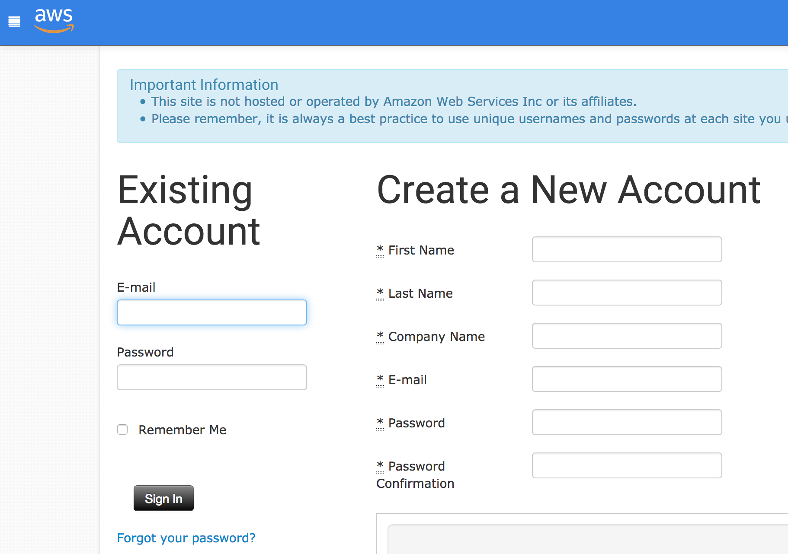
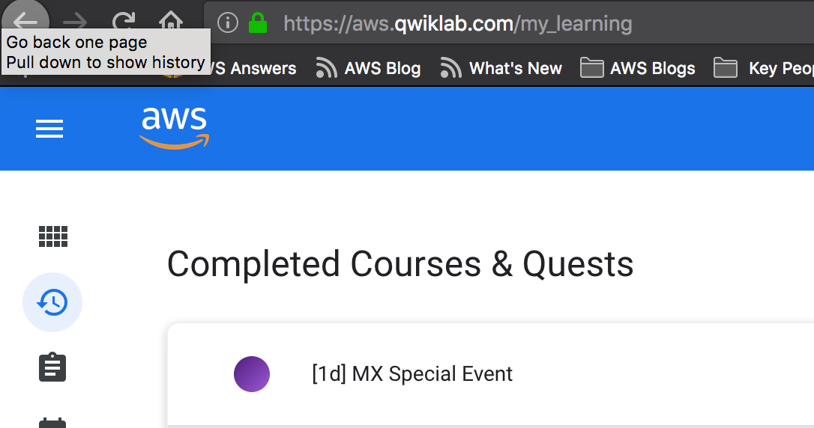

# Welcome to the Containers On AWS Workshop

Hello and welcome to the Containers On AWS Workshop! Please, read the instructions bellow carefully.

## 1) It's all about containers!

We will walk you through the very basics of containers: from installing and configuring Docker in your own machine, running containers locally, till finally deploying them on AWS container services like Elastic Container Services (ECS).

## 2) If you are using a Windows machine

We are working on a content for running this workshop using a Windows machine. Meanwhile, please, we strongly recommend you spinning up an EC2 instance running Amazon Linux. The following links will guide you through the instance creation process and how to access it:

* [Creating a Linux EC2 instance](https://docs.aws.amazon.com/AWSEC2/latest/UserGuide/EC2_GetStarted.html)
* [Accessing a Linux EC2 instance from a Windows machine](https://docs.aws.amazon.com/AWSEC2/latest/UserGuide/putty.html)

## 3) If you not bring your own account -- setup your Qwiklab account

The recommended way of walking through these labs are with your own (**non-production**) AWS account. In case you don't have one you can setup a Qwiklab account at:

### https://aws.qwiklab.com

 
Once logged-in, go to My Learning and Open the **[Mx] Special Event session**.

 

> If you can't see the session on your My Learning page, please **reach out to your lab assistant**.

## Today Labs

### Lab 1: Warm-up: Docker, AWS CLI and ECR

1. [Setup Environments](01-SetupEnvironment/)

2. [Creating Your Docker Image](02-CreatingDockerImage/)

3. [Creating A VPC](03-CreateVPC/)

### Lab 2: Create your first ECS Cluster

4. [Running An ECS Cluster](04-DeployEcsCluster/)

### Lab 3: Containers — without servers!

5. [Deploying An Application with AWS Fargate](05-DeployFargate/)

### Lab 4: Continuous Deployment with ECS

6. [Build a Continuous Deployment Pipeline](http://running-containers-on-aws-fargate.s3-website-us-east-1.amazonaws.com/build-a-continuous-deployment-pipeline.html)
